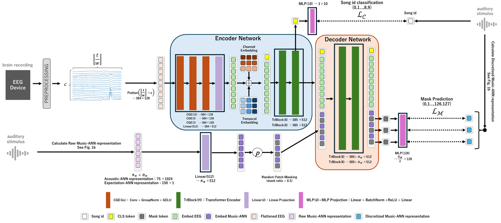

# Expectation and Acoustic Neural Network Representations Enhance Music Identification from Brain Activity

**PredANN++** is a representation-learning framework for EEG-based music identification.

The model learns EEG representations by predicting music-derived neural network features (Acoustic / Surprisal / Entropy) computed from the corresponding audio stimulus.  
By aligning EEG signals with acoustic and expectation-related teacher representations, PredANN++ enhances downstream EEG-based song identification performance.

This repository provides the full training pipeline, pretrained checkpoints, and evaluation code for reproducible EEG-to-music decoding.

## Neural Network Architecture

The overall neural network architecture of **PredANN++** is illustrated below.

This model is designed to predict **ANN-representations primarily encoding acoustic information (acoustic representations:MuQ-Embedding)** or **ANN-representations primarily encoding predictive information (surprisal/entropy-based representations:MusicGEN-Surprisal/Entropy)** from EEG signals, and to use these predicted representations for downstream EEG-based recognition.



## Setup

### Environment setup

We recommend creating an isolated Python environment before installing dependencies.

```bash
conda create -n predann_env python=3.8
conda activate predann_env
```

Install required Python packages:

```bash
pip install -r requirements.txt
```
> ### Important
> - This codebase **requires `pytorch-lightning==1.4.0`**.
> - Newer versions of PyTorch Lightning are **not compatible** with this implementation.
>
> ### Tested environment
> - OS: **Ubuntu 20.04**
> - Python: **3.8**
> - PyTorch: **2.1.2+cu118**
> - TorchVision: **0.16.2+cu118**
> - TorchAudio: **2.1.2+cu118**
> - PyTorch Lightning: **1.4.0**
> - CUDA runtime: **11.8 (PyTorch cu118 build)**
> - GPU: **NVIDIA RTX A6000 (48GB VRAM)**
> - NVIDIA Driver: **>= 520.xx** (compatible with CUDA 11.8)

## Pretrained Model Checkpoints

We release pretrained **PredANN++ checkpoints** via Hugging Face Hub.
These models predict ANN-derived music representations from EEG signals
and are intended for **finetuning and evaluation in EEG-based music recognition**.

### Available Models

| Model | Target Representation | Context | Pretraining | Finetuning | Hugging Face🤗 |
|------|----------------------|---------|-------------|------------|--------------|
| PredANN++ Entropy | MusicGEN-Entropy | 16 s | 10k epochs (50% masking) | 3.5k epochs | [Shogo-Noguchi/PredANNpp-Entropy-ctx16](https://huggingface.co/Shogo-Noguchi/PredANNpp-Entropy-ctx16) |
| PredANN++ Surprisal | MusicGEN-Surprisal | 16 s | 10k epochs (50% masking) | 3.5k epochs | [Shogo-Noguchi/PredANNpp-Surprisal-ctx16](https://huggingface.co/Shogo-Noguchi/PredANNpp-Surprisal-ctx16) |

>Pretrained models are publicly available on Hugging Face.

**Common settings**
- Random seed: **42**
- Dataset: **NMED-T**
- Task: **Song-level music identification from EEG**

## Quick Demo (Gradio UI)

This repository provides a **Gradio-based demo** to quickly run **3-second EEG → Song ID (0-9)** inference
using the released checkpoints in `checkpoints/`.

> IMPORTANT (Public repository)
> - **NMED‑T EEG/audio data is NOT included** in this repository.
> - Please download a sample EEG trial from the official NMED‑T dataset and place it under:
>   - `<NMEDT_BASE_DIR>/DS_EEG_pkl/`
>   - `<NMEDT_BASE_DIR>/audio/`
> - The demo uses the **exact same dataloader** as training (`preprocessing_eegmusic_dataset_3s.py`)
>   to prioritize reproducibility over UI convenience.

### Install demo dependencies

```bash
pip install -r requirements.txt
pip install -r requirements_demo.txt
```
### Launch demo
```bash
python demo.py --dataset_dir /path/to/NMED-T_dataset
```
In the UI, select:
- checkpoint (Entropy / Surprisal)
- sample index (SW_valid)

and you will see:

- GT Song ID label
- Top-1 / Top-K prediction + ✅/❌
- Softmax probability bar plot
- quick accuracy (optional)

---

## Dataset
This work uses the **Naturalistic Music EEG Dataset – Tempo (NMED-T)**.

**Dataset reference**  
Steven Losorelli, Duc T. Nguyen, Jacek P. Dmochowski, and Blair Kaneshiro (2017).  
*Naturalistic Music EEG Dataset - Tempo (NMED-T).*  
Stanford Digital Repository.  
Available from: https://purl.stanford.edu/jn859kj8079

**Original Paper**
The NMED-T dataset was introduced in the following paper:
Steven Losorelli, Duc T. Nguyen, Jacek P. Dmochowski, and Blair Kaneshiro (2017). [NMED-T: A Tempo-Focused Dataset of Cortical and Behavioral Responses to Naturalistic Music](https://ccrma.stanford.edu/groups/meri/assets/pdf/losorelli2017ISMIR.pdf). In *Proceedings of the 18th International Society for Music Information Retrieval Conference*, Suzhou, China.

**Preprocessing**: Run [scripts/data_prep/](scripts/data_prep/) to generate required features (Surprisal, Entropy, MuQ) 
See scripts[/data_prep/README.md].


## Dataset Path Configuration
To ensure successful execution, configure the dataset paths to match your local environment.
- **Recommended (CLI)**:
    - set `--dataset_dir` to your local NMED-T dataset directory.
- **Alternative (edit code)**:

    update the dataset base directory in the following preprocessing script:
    - `codes_3s/predann/datasets/preprocessing_eegmusic_dataset_3s.py`
    - The `Preprocessing_EEGMusic_dataset` class loads the dataset using`_base_dir`.
In our example, the path is set as:

```python
_base_dir = "/path/to/NMED-T_dataset"
```

Your `NMEDT_BASE_DIR` directory is expected to contain:
- audio/
    - audio files (obtained from the official NMED-T dataset website.) should be used in `scripts/data_prep`.
- DS_EEG_pkl/
    - Preprocessed EEG recordings (128 channels, 125 Hz) obtained from the official NMED-T dataset website.
- NoClip_Discreat_K1Surprisal/
    - Discretized MusicGEN-Surprisal
- Entropy_k1_Q128/
    - Discretized MusicGEN-Entropy
- MuQ_Discreat_K128/
    - Discretized MuQ-Embedding
- surprisal_k1/
    - Raw MusicGEN-Surprisal
- MuQ_Continuous_embedding
    - Raw MuQ-Embedding
- entropy_k1
    - Raw MusicGEN-Entropy

## Training

All scripts in `codes_3s/scripts/` are convenience wrappers.
For a full CLI reference and [.sh]-independent examples, see:
- [`docs/cli_reference.md`](docs/cli_reference.md)
- [`docs/README.md`](docs/README.md)

For local GitHub Pages verification (including the Song 21 synchronized visualization), run the localhost flow in:
- [`docs/README.md` section "GitHub Pages local test (before push)"](docs/README.md)

### Modes
This repository supports Finetune and Multitask modes:
- Finetune
    - If `--pretrain_ckpt_path` is not provided (or set to `none`), this is equivalent to training from scratch (**Fullscratch**).
- MuQMultitask
- SurpMultitask
- EntropyMultitask

### Quick start (using scripts)

```bash
# 1. Pretrain (from scratch)
bash run_fullscratch.sh

# 2. MuQ Multitask (50% masking)
bash run_muq_50per_multitask.sh

# 3. Surprisal Multitask (50% masking)
bash run_surp_50per_multitask.sh

# 4. Entropy Multitask (50% masking)
bash run_ent_50per_multitask.sh

# 5. Finetune from checkpoint
bash run_finetune_from_ckpt.sh <ckpt_path> [seed] [run_name]

# 6. Ensemble across seeds
bash evaluation.sh "<seeds>" "<mode>"
```


## Code Structure
```bash
codes_3s/
├── main_3s.py                       # Training orchestrator
├── config/config.yaml               # Default hyperparameters
├── predann/
│   ├── datasets/
│   │   └── preprocessing_eegmusic_dataset_3s.py  # NMED-T dataloader
│   ├── models/
│   │   ├── modeling_fineEMenc.py       # Encoder (pretrain/finetune)
│   │   ├── ms20_modeling_preEMenc.py   # Enc-Dec for Surprisal/Entropy (20ms)
│   │   └── ms40_modeling_preEMenc.py   # Enc-Dec for MuQ (40ms)
│   ├── modules/
│   │   ├── EM_finetune.py
│   │   ├── MuQ_multitask.py
│   │   ├── Surprisal_multitask.py
│   │   └── Entropy_multitask.py
│   └── utils/
└── scripts/
    ├── run_fullscratch.sh
    ├── run_muq_50per_multitask.sh
    ├── run_surp_50per_multitask.sh
    ├── run_ent_50per_multitask.sh
    ├── run_finetune_from_ckpt.sh
    └── evaluation.sh
```

## License

This project is under the CC-BY-SA 4.0 license. See [LICENSE](LICENSE) for details.

## Copyright

Copyright (c) 2026 Sony Computer Science Laboratories, Inc., Tokyo, Japan. All rights reserved. This source code is licensed under the [LICENSE](LICENSE). 


