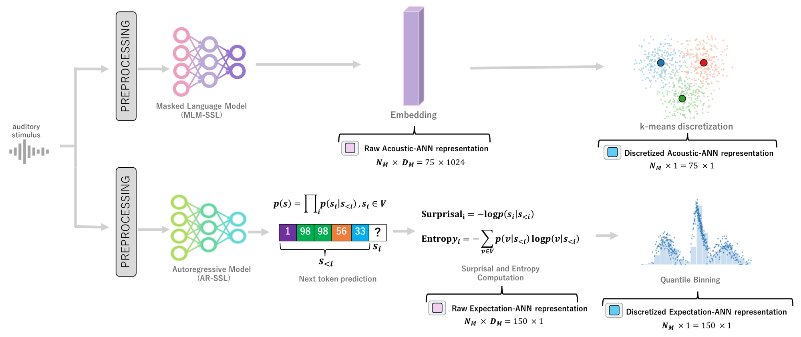

# Data Preparation (NMED‑T): Audio → Music Features (Surprisal / Entropy / MuQ)

Last verified: 2026-02-05

This folder contains the **official data-preparation pipeline** for PredANN++.

- Input: NMED‑T audio (10 songs) + EEG pickles
- Output: Music features used for multitask pretraining:
  - **Surprisal / Entropy** (MusicGen / Audiocraft)
  - **MuQ embedding** (MuQ)

> IMPORTANT (Public repository)
>
> - This repository does **NOT** redistribute NMED‑T EEG or audio files.
> - Please download NMED‑T from the official distribution and comply with its license.
> - We keep the output directory names consistent with the training dataloader
>   (`codes_3s/predann/datasets/preprocessing_eegmusic_dataset_3s.py`).
> - Reproducibility over convenience: follow the directory names exactly.

---

## 0. Pipeline overview (figure)

Below is the full pipeline diagram:



---

## 1. Expected dataset directory structure

Let `<NMEDT_BASE_DIR>` be your local NMED‑T directory.

Minimum required structure:

```text
<NMEDT_BASE_DIR>/
├── audio/
│   ├── 21.wav
│   ├── 22.wav
│   ├── ...
│   └── 30.wav
└── DS_EEG_pkl/
    ├── <subject>_<song>_1.pkl
    └── ...
```

The feature directories below will be generated by the scripts in this folder.

## 2. Requirements (separate from training requirements)
We recommend using a dedicated environment for data_prep, because it may require
additional packages (audiocraft, librosa, etc.).
```bash
# Example
conda create -n predann_data_prep python=3.8
conda activate predann_data_prep

pip install -r requirements.txt
```
`requirements.txt` in this folder is intentionally separated from the training requirements in the repository root.
## 3. Surprisal / Entropy (MusicGen)
### 3.1 Default pipeline (newMF; 0.1s stride, 3s segments, context windows)
### Script:
- `compute_surprisal_entropy.py`
- `discretize_surprisal_entropy.py`
### What it produces (per context window):
- `SurpEnt0.1stride/` (8s context)
- `SurpEnt0.1stride_ctx16/`(16s context)
- `SurpEnt0.1stride_ctx32/`(32s context)
Inside each folder:
```text
SurpEnt0.1stride_ctx16/
└── 21/
    ├── surp.npy        # float32, shape=(N_seg, 150)
    ├── ent.npy         # float32, shape=(N_seg, 150)
    ├── surp_Q128.npy   # uint8  , shape=(N_seg, 150)
    ├── ent_Q128.npy    # uint8  , shape=(N_seg, 150)
    └── meta.csv        # segment_idx,segment_start_s,segment_end_s
```
### Compute Surprisal+Entropy (example: 16s context window)
```bash
python compute_surprisal_entropy.py \
  --audio_dir <NMEDT_BASE_DIR>/audio \
  --out_root  <NMEDT_BASE_DIR>/SurpEnt0.1stride_ctx16 \
  --mode both \
  --window_sec 16.0
```
### Discretize Surprisal+Entropy (Q=128)
```bash
python discretize_surprisal_entropy.py \
  --input_root <NMEDT_BASE_DIR>/SurpEnt0.1stride_ctx16 \
  --feature both
```
### How training uses it
In `codes_3s/main_3s.py`, enable newMF:
```bash
python codes_3s/main_3s.py \
  --mode SurpMultitask \
  --dataset_dir <NMEDT_BASE_DIR> \
  --use_new_mf 1 \
  --new_mf_context_win 16
```
or for Entropy:
```bash
python codes_3s/main_3s.py \
  --mode EntropyMultitask \
  --dataset_dir <NMEDT_BASE_DIR> \
  --use_new_mf 1 \
  --new_mf_context_win 16
```
### 3.2 Conservative pipeline (30s-chunk based)
This is an older/alternative pipeline that computes Surprisal/Entropy on **30-second audio chunks**.
### Scripts:
- `save_nmedt_audio_30s.py`
- `compute_surprisal_entropy_conservative.py`
- `discretize_surprisal_entropy_conservative.py`
### Step 1: Split raw audio into 30s chunks
```bash
python save_nmedt_audio_30s.py \
  --nmed_root <NMEDT_BASE_DIR> \
  --out_root  <NMEDT_BASE_DIR>
```
This generates:
```text
<NMEDT_BASE_DIR>/audio_30s/
├── 21_chunk0.wav
├── ...
└── 30_chunk7.wav
```
### Step 2: Compute continuous Surprisal/Entropy (30s)
```bash
python compute_surprisal_entropy_conservative.py \
  --audio_dir <NMEDT_BASE_DIR>/audio_30s \
  --out_root  <NMEDT_BASE_DIR> \
  --mode both
```
This generates:
```text
<NMEDT_BASE_DIR>/
├── surprisal_k1/    # float32, each file shape=(1500,)
└── entropy_k1/      # float32, each file shape=(1500,)
```
### Step 3: Discretize (Q=128)
```bash
python discretize_surprisal_entropy_conservative.py \
  --out_root <NMEDT_BASE_DIR> \
  --feature both
```
This generates:
```text
<NMEDT_BASE_DIR>/
├── NoClip_Discreat_K1Surprisal/   # uint8, each file shape=(1500,)
└── Entropy_k1_Q128/               # uint8, each file shape=(1500,)
```
>NOTE:
>- The training dataloader supports both pipelines:
>   - default (newMF) when `--use_new_mf 1`
>   - conservative (30s-chunk) when `--use_new_mf 0`
>- Keep directory names EXACTLY as above, otherwise the dataloader will fail.

## 4. MuQ embedding (acoustic representation)
## Script:
- `process_muq.py`
### 4.1 Why MuQ needs manual checkpoint placement
Unlike MusicGen (which can auto-download weights), MuQ checkpoints are typically downloaded manually.
This repository expects you to download and place:
- `config.json`
- `pytorch_model.bin`
from:
- https://huggingface.co/OpenMuQ/MuQ-large-msd-iter (Last verified: 2026-02-05)
into a single directory, e.g.:
```text
/path/to/MuQ-large-msd-iter/
├── config.json
└── pytorch_model.bin
```
### 4.2 Run extraction + k-means discretization
```bash
python process_muq.py \
  --mode all \
  --audio_dir <NMEDT_BASE_DIR>/audio_30s \
  --out_root  <NMEDT_BASE_DIR> \
  --muq_checkpoint_dir /path/to/MuQ-large-msd-iter \
  --device cuda
  ```
  This generates:
```text
  <NMEDT_BASE_DIR>/
├── MuQ_Continuous_embedding/   # float32, each file shape=(750,1024)
└── MuQ_Discreat_K128/          # uint8  , each file shape=(750,)
```
>IMPORTANT:
>- The output directory is intentionally named `MuQ_Discreat_K128` to match`codes_3s/predann/datasets/preprocessing_eegmusic_dataset_3s.py`.

## 5. Licensing notes (high-level)
Audiocraft code is MIT; MusicGen model weights are CC-BY-NC 4.0

OpenMuQ checkpoint: code MIT; model weights CC-BY-NC 4.0

Please ensure your use complies with all upstream licenses.

